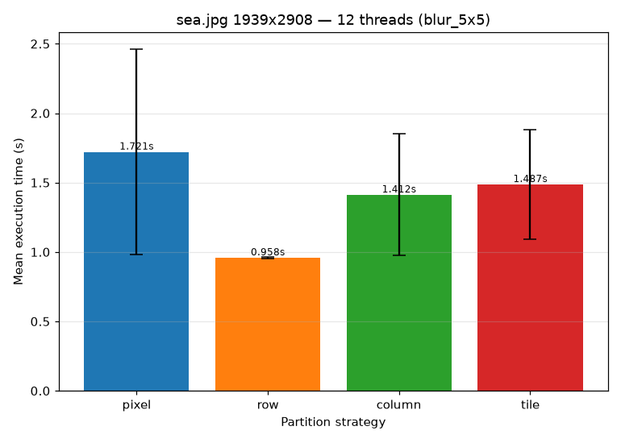
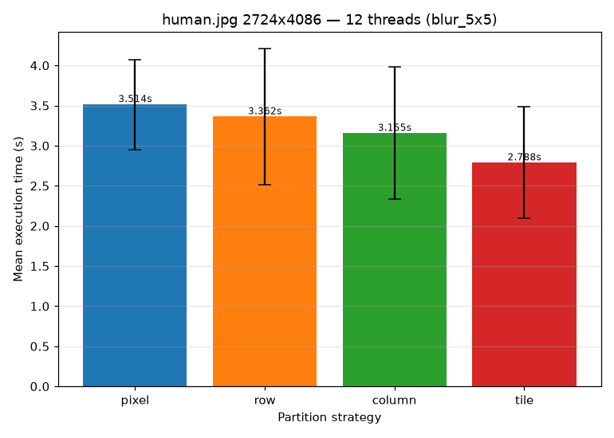
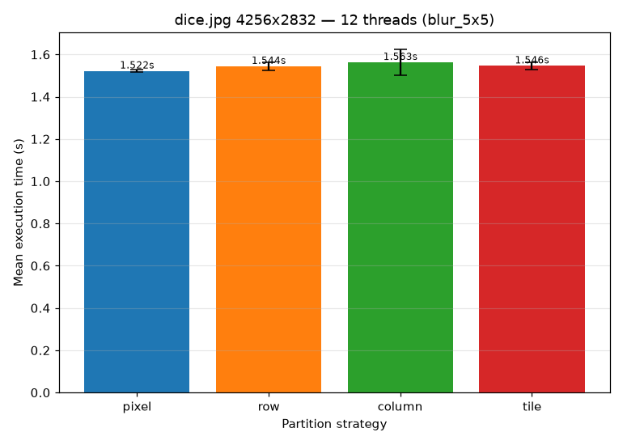
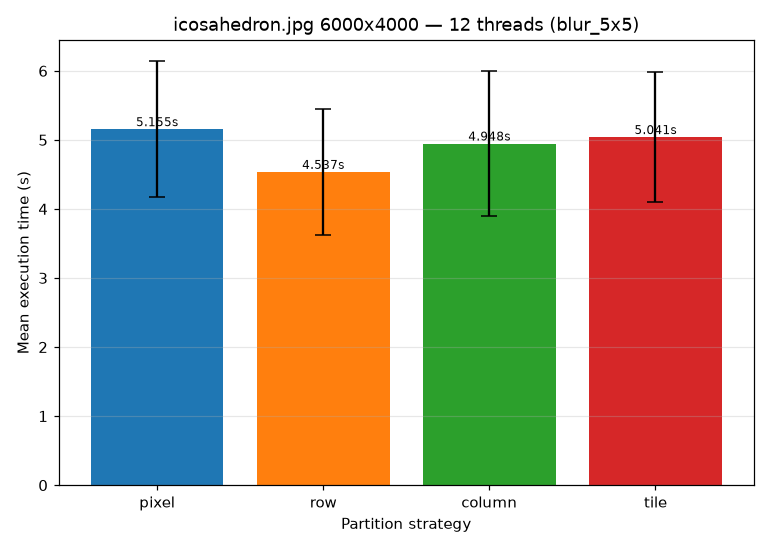

# Parallel Benchmark — partition strategies (`blur_5x5`)

Compares the four partition strategies (`--partition pixel|row|column|tile`) on 4 images (`sea.jpg`, `human.jpg`, `dice.jpg`, `icosahedron.jpg`) selected from `assets/*.jpg` by the resolution-percentile rule. Every image/partition pair is timed 10 times after one discarded warmup, at a fixed 12 threads with `--schedule static` and `--kernel blur_5x5`.

Сравнение четырех стратегий (`--partition pixel|row|column|tile`) на 4х изображениях (`sea.jpg`, `human.jpg`, `dice.jpg`, `icosahedron.jpg`), отобранных из `assets/*.jpg`. Каждая пара (изображение, стратегия) прогнана 10 раз после одного холостого теста, на 12 потоках с флагами `--schedule static` и `--kernel blur_5x5`.

## Окружение

- **CPU:** AMD Ryzen 5 7640HS
- **Logical cores:** 12
- **OS:** Linux 7.2.8-arch1-1
- **Python:** 3.14.7
- **CLI:** `./build/cli/image_conv_cli`
- **Schedule:** `static`
- **Kernel:** `blur_5x5`

## Замеры

### `sea.jpg` (1939x2908, 5638612 px)

| Partition | Mean (s) | Stdev (s) |
| --- | --- | --- |
| pixel | 1.7207 | 0.7397 |
| row | 0.9582 | 0.0081 |
| column | 1.4117 | 0.4379 |
| tile | 1.4865 | 0.3925 |

### `human.jpg` (2724x4086, 11130264 px)

| Partition | Mean (s) | Stdev (s) |
| --- | --- | --- |
| pixel | 3.5139 | 0.5611 |
| row | 3.3617 | 0.8469 |
| column | 3.1554 | 0.8241 |
| tile | 2.7878 | 0.6931 |

### `dice.jpg` (4256x2832, 12052992 px)

| Partition | Mean (s) | Stdev (s) |
| --- | --- | --- |
| pixel | 1.5223 | 0.0056 |
| row | 1.5443 | 0.0180 |
| column | 1.5629 | 0.0608 |
| tile | 1.5465 | 0.0183 |

### `icosahedron.jpg` (6000x4000, 24000000 px)

| Partition | Mean (s) | Stdev (s) |
| --- | --- | --- |
| pixel | 5.1554 | 0.9848 |
| row | 4.5367 | 0.9105 |
| column | 4.9477 | 1.0456 |
| tile | 5.0412 | 0.9421 |

При 12 потоках и статическом планировании разница между стратегиями на любом отдельном изображении не превышает 80% (наибольший разброс на `sea.jpg`).

Единого победителя нет: `sea.jpg` -> `row`, `human.jpg` -> `tile`, `dice.jpg` -> `pixel`, `icosahedron.jpg` -> `row`.

Стратегия `pixel` показала себя наименее предсказуемо: она обгоняет остальные на `dice.jpg`, но оказывается медленнее всех на `sea.jpg`, `human.jpg` и `icosahedron.jpg`. Ее стандартное отклонение колеблется от 0.01 с до 0.98 с.

Выбор оптимального варианта завязан на ориентацию: портретные изображения предпочитают `row`/`tile`, а альбомные - `pixel`/`row`.

Итоговая разница в скорости незначительна на фоне шума замеров и непараллеливаемых расходов на декодирование JPG и кодирование PNG. Поэтому при 12 потоках выбор стратегии влияет скорее на стабильность результатов, чем на реальную производительность.
