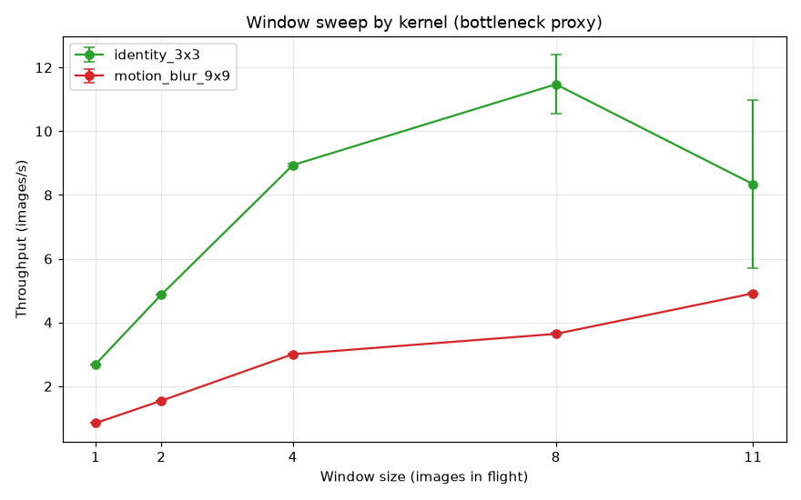
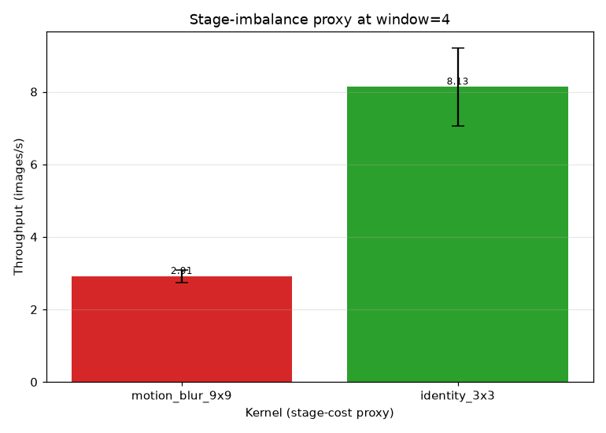

# Pipeline Benchmark — bounded window and stage imbalance

Тестирование режима `--pipeline` на фиксированной серии из 11 изображений `assets/pipeline/image_0..10.jpg` (все 1920x1080). Проведено три эксперимента: 
1) перебор размера окна для обоих ядер. Каждая конфигурация замерена 5 раз после одного разогревочного теста.
2) эмуляция дисбаланса стадий при окне=4 (сравнение тяжелого `motion_blur_9x9` и быстрого `identity_3x3`);

## Окружение

- **CPU:** AMD Ryzen 5 7640HS w/ Radeon 760M Graphics
- **Logical cores:** 12
- **OS:** Linux 7.2.8-arch1-1
- **Python:** 3.14.7
- **CLI:** `./build/cli/image_conv_cli`

## Параметры эксперимента

- **--window:** 1, 2, 4, 8, 11
- **Images:** 11 (1920x1080)

## Замеры

| Experiment | Kernel | Window | Mean (s) | Stdev (s) | Throughput (img/s) |
| --- | --- | --- | --- | --- | --- |
| window_sweep | blur_5x5 | 1 | 6.040 | 0.013 | 1.82 |
| window_sweep | blur_5x5 | 2 | 3.298 | 0.005 | 3.34 |
| window_sweep | blur_5x5 | 4 | 1.794 | 0.128 | 6.13 |
| window_sweep | blur_5x5 | 8 | 1.442 | 0.024 | 7.63 |
| window_sweep | blur_5x5 | 11 | 1.005 | 0.009 | 10.95 |
| stage_imbalance | motion_blur_9x9 | 4 | 3.777 | 0.239 | 2.91 |
| stage_imbalance | identity_3x3 | 4 | 1.353 | 0.184 | 8.13 |
| interaction | identity_3x3 | 1 | 4.093 | 0.003 | 2.69 |
| interaction | identity_3x3 | 2 | 2.258 | 0.004 | 4.87 |
| interaction | identity_3x3 | 4 | 1.231 | 0.006 | 8.94 |
| interaction | identity_3x3 | 8 | 0.959 | 0.070 | 11.47 |
| interaction | identity_3x3 | 11 | 1.319 | 0.390 | 8.34 |
| interaction | motion_blur_9x9 | 1 | 13.068 | 0.003 | 0.84 |
| interaction | motion_blur_9x9 | 2 | 7.126 | 0.011 | 1.54 |
| interaction | motion_blur_9x9 | 4 | 3.662 | 0.012 | 3.00 |
| interaction | motion_blur_9x9 | 8 | 3.022 | 0.019 | 3.64 |
| interaction | motion_blur_9x9 | 11 | 2.239 | 0.010 | 4.91 |

## Перебор размера окна для разных ядер

## Дисбаланс стадий - показатель (window=4)

Выбор ядра здесь служит показателем стоимости, имитирующим дисбаланс стадий, а не мерой реальной задержки ввода-вывода.

## Анализ

При window=4 тяжелый `motion_blur_9x9` выдает 2.91 изобр/с против 8.13 изобр/с у `identity_3x3` (разница в 2.8 раза). В первом случае скорость упирается в вычисления свертки, а во втором - в операции чтения и записи.

При расширении window от 1 до 11 прирост производительности у ядра identity составил +210%, а у ядра с тяжелой сверткой - +484%.

Тяжелое ядро получает от широкого окна значительно больше выгоды (+484% против +210%): его скорость пикует на окне=11, в то время как identity выходит на предел раньше (на окне=8) и затем убывает, когда легкая задача перестает загружать потоки.

В этой сборке параллелизация идет по изображениям (обработка одного кадра однопоточная), поэтому широкое окно просто держит больше сверток в работе одновременно. Пик производительности будет когда одна свертка сможет сама полностью загрузить все потоки, чего здесь не происходит.

Дисбаланс стадий смоделирован за счет вычислительной сложности ядра, а не медленной работы с диском. Поэтому эти цифры отражают поведение окна при разном соотношении вычислений к ввода-выводу, а не реальную задержку I/O.
