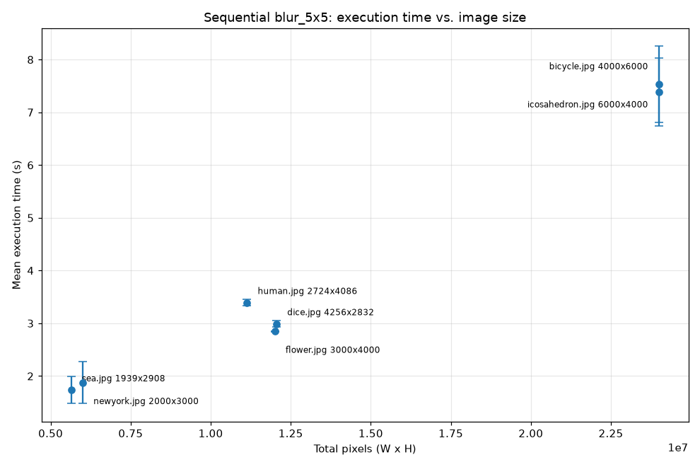

# Последовательная свёртка - `blur_5x5`

Замеры времени последовательной свертки (`--kernel blur_5x5` без `--partition`) для 7 изображений из `assets/*.jpg`. Каждое прогнано 10 раз после одного разогревочного теста; ниже приведены среднее время и стандартное отклонение.

## Окружение

- **CPU:** AMD Ryzen 5 7640HS
- **Logical cores:** 12
- **OS:** Linux 7.2.8-arch1-1
- **Python:** 3.14.7
- **CLI:** `./build/cli/image_conv_cli`

## Замеры

| Filename | Resolution | Pixels | Mean (s) | Stdev (s) |
| --- | --- | --- | --- | --- |
| sea.jpg | 1939x2908 | 5638612 | 1.7360 | 0.2536 |
| newyork.jpg | 2000x3000 | 6000000 | 1.8781 | 0.3999 |
| human.jpg | 2724x4086 | 11130264 | 3.3911 | 0.0591 |
| flower.jpg | 3000x4000 | 12000000 | 2.8498 | 0.0081 |
| dice.jpg | 4256x2832 | 12052992 | 2.9894 | 0.0620 |
| bicycle.jpg | 4000x6000 | 24000000 | 7.5281 | 0.7259 |
| icosahedron.jpg | 6000x4000 | 24000000 | 7.3795 | 0.6434 |

Время работы прямо пропорционально размеру файла: от 1736 мс на маленьком `sea.jpg` (1939x2908) до 7380 мс на крупном `icosahedron.jpg` (6000x4000) - рост количества пикселей в 4,3 раза дает ровно такой же прирост по времени.

Затраты на пиксель практически постоянны (0,24–0,31 мкс), поэтому масштабирование идет строго линейно.

Оверхеда на маленьких изображениях нет: наименьший файл обрабатывается с теми же 0,31 мкс/пиксель, что и наибольший. Накладные расходы на декодирование JPG и кодирование PNG исчезающе малы на фоне многосекундной свертки.

Единственный нестабильный результат показал `bicycle.jpg`: его стандартное отклонение составило 726 мс (10% от среднего), поэтому его среднее значение наименее надежно.
